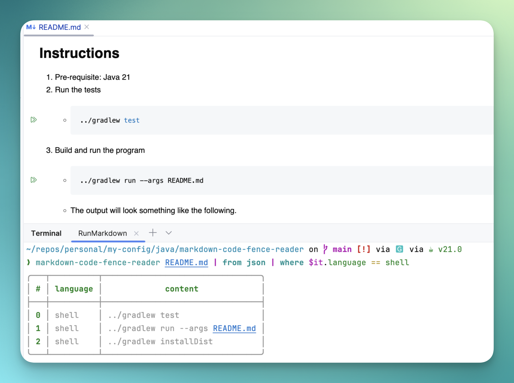

# markdown-code-fence-reader

Read code fences from Markdown files.



## Overview

This program parses code fences (triple back-tick content) out of a Markdown file and returns them formatted in a JSON
array. Extracting those snippets facilitates your ability to run those in your shell, and this is exactly why I wrote
this program. See the accompanying Nushell code elsewhere in this repository.


## Instructions

1. Pre-requisite: Java 21
2. Run the tests
    * ```shell
      ../gradlew test
      ```
3. Build the program distribution
    * ```shell
      ../gradlew installDist
      ```
4. Install it somewhere
    * ```nushell
      ln -sf ('build/install/markdown-code-fence-reader/bin/markdown-code-fence-reader' | path expand) ~/.local/bin/markdown-code-fence-reader 
      ```


## Wish List

General clean-ups, TODOs and things I wish to implement for this project

* [x] DONE Wire in ~~commonmark-java~~ [jetbrains/markdown](https://github.com/JetBrains/markdown). commonmark-java
  is not parsing code blocks inside lists at all unfortunately and that's the exact use case I have.
* [x] DONE Return as JSON.
* [x] DONE Nushell side of things.
